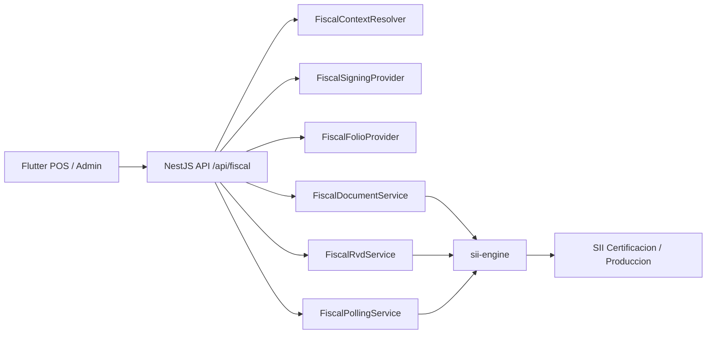

# Business App SII

Backend NestJS para operar documentos tributarios electronicos con `sii-engine` como unica capa fiscal.

Este proyecto reemplaza la integracion antigua con SimpleAPI. No debe existir diseno, fallback, runtime, variables de entorno ni endpoints productivos asociados a SimpleAPI.

## Estado actual

- NestJS expone la API REST para Flutter/POS y administra seguridad, contexto fiscal, certificados, CAF, folios, RVD y polling.
- `sii-engine` se usa como libreria local para XML, firma, token SII, envio, validaciones fiscales, parsers y sanitizacion.
- `pnpm workspace` conecta este backend con la libreria local `sii-engine` mediante `"sii-engine": "workspace:*"`.
- La emision de boleta electronica `tipoDTE=39` ya alcanza el upload del SII en certificacion y devuelve `trackId`.
- La persistencia actual de certificados, CAF, folios y tracking es in-memory/local para desarrollo. Produccion debe reemplazarla por storage transaccional, cifrado y auditable.

## Arquitectura



Responsabilidades:

- NestJS: autenticacion API key, DTOs, rate limiting, tenant/emisor, secretos, folios, tracking, idempotencia, colas futuras y respuestas publicas.
- `sii-engine`: construccion XML, TED, firmas, token SII, clientes SII, parsers, estados publicos y sanitizacion.
- Flutter: nunca recibe PFX, password, CAF completo, RSASK, private keys, token SII, cookies ni XML firmado.

## Requisitos

- Node.js compatible con NestJS 11.
- Corepack habilitado.
- pnpm `11.0.9`.
- Acceso local a `sii-engine` en el workspace.
- Certificado PFX valido para pruebas locales.
- CAF XML valido para el RUT emisor y tipo DTE requerido.

Estructura esperada en desarrollo:

```text
C:\Users\bbrev\OneDrive\Desktop\nest\myfirstapp
C:\Users\bbrev\OneDrive\Desktop\biblioteca sii\sii-engine
```

`pnpm-workspace.yaml` debe incluir:

```yaml
packages:
  - .
  - ../../biblioteca sii/sii-engine
```

## Instalacion

Desde `C:\Users\bbrev\OneDrive\Desktop\nest\myfirstapp`:

```powershell
corepack enable
corepack pnpm install
```

Verificar que `sii-engine` resuelve como workspace:

```powershell
corepack pnpm list sii-engine
```

## Variables de entorno

Minimo para levantar el backend:

```env
API_KEY_FRONTEND=change-me-local
PORT=3002
CORS_ORIGIN=http://localhost:3000
```

Bootstrap local/certificacion opcional:

```env
SII_AMBIENTE=0
SII_RUT_EMISOR=11111111-1
SII_RUT_FIRMANTE=22222222-2
SII_FECHA_RESOLUCION=2020-01-01
SII_NRO_RESOLUCION=0
SII_PFX_PATH=C:\secure\certificado.pfx
SII_PFX_PASSWORD=change-me
SII_CAF_PATH=C:\secure\caf-39.xml
```

Notas de seguridad:

- No commitear `.env`.
- No usar variables `SIMPLEAPI_*`; el arranque falla si detecta variables heredadas de SimpleAPI.
- En `NODE_ENV=production`, no se permite bootstrap fiscal desde `.env`. Produccion debe resolver PFX/CAF/emisores desde providers productivos por tenant.
- El PFX y CAF pueden usarse localmente solo para certificacion/desarrollo.

## Arranque local

```powershell
corepack pnpm run start
```

Con puerto explicito:

```powershell
$env:PORT="3002"
corepack pnpm run start
```

Swagger queda disponible en:

```text
http://localhost:3002/api
```

## Autenticacion

Los endpoints fiscales mutables requieren header:

```http
x-api-key: <API_KEY_FRONTEND>
```

El health fiscal puede usarse para diagnostico basico:

```http
GET /api/fiscal/health
```

## Contexto fiscal

Los endpoints aceptan `context` opcional. En desarrollo, si no se envia, se resuelve desde `.env`. En produccion, el contexto debe venir de tenant/merchant/branch/autorizacion/storage.

Ejemplo:

```json
{
  "context": {
    "tenantId": "tenant-local",
    "merchantId": "merchant-local",
    "branchId": "branch-1",
    "fechaResolucion": "2020-01-01",
    "nroResolucion": 0
  }
}
```

El RUT emisor, ambiente y certificado se resuelven internamente por `FiscalContextResolver` y providers.

## Endpoints

Base URL local:

```text
http://localhost:3002/api
```

### Health

```http
GET /api/fiscal/health
```

Respuesta esperada:

```json
{
  "success": true,
  "data": {
    "status": "ok"
  }
}
```

### Importar CAF XML emitido por SII

```http
POST /api/fiscal/folios/cafs
```

Body:

```json
{
  "context": {
    "fechaResolucion": "2020-01-01",
    "nroResolucion": 0
  },
  "cafXml": "<?xml version=\"1.0\"?><AUTORIZACION>...</AUTORIZACION>"
}
```

Respuesta publica:

```json
{
  "success": true,
  "data": {
    "rutEmisor": "11111111-1",
    "razonSocial": "EMPRESA DEMO",
    "tipoDTE": 39,
    "rangeStart": 1,
    "rangeEnd": 10,
    "fechaAutorizacion": "2026-01-01",
    "idk": "100"
  }
}
```

Nunca devuelve `cafXml`, `RSASK`, private key ni XML completo.

### Consultar estado de folios

```http
GET /api/fiscal/folios/status?tipoDTE=39&fechaResolucion=2020-01-01&nroResolucion=0
```

Respuesta:

```json
{
  "success": true,
  "data": [
    {
      "caf": {
        "rutEmisor": "11111111-1",
        "tipoDTE": 39,
        "rangeStart": 1,
        "rangeEnd": 10,
        "fechaAutorizacion": "2026-01-01"
      },
      "status": "active",
      "remaining": 10
    }
  ]
}
```

### Reservar folio

```http
POST /api/fiscal/folios/reserve
```

Body con folio automatico:

```json
{
  "context": {
    "fechaResolucion": "2020-01-01",
    "nroResolucion": 0
  },
  "tipoDTE": 39
}
```

Body con folio especifico:

```json
{
  "context": {
    "fechaResolucion": "2020-01-01",
    "nroResolucion": 0
  },
  "tipoDTE": 39,
  "folio": 10
}
```

### Solicitar CAF automaticamente desde portal SII

```http
POST /api/fiscal/folios/requests
```

Body:

```json
{
  "context": {
    "fechaResolucion": "2020-01-01",
    "nroResolucion": 0
  },
  "tipoDTE": 39,
  "quantity": 1,
  "idempotencyKey": "caf-demo-001"
}
```

Funcionamiento:

- Obtiene token SII usando certificado.
- Entra al portal SII de certificacion.
- Solicita folios.
- Descarga CAF.
- Valida e importa el CAF internamente.
- Devuelve solo metadata publica.

Variables utiles para diagnostico local:

```env
SII_PORTAL_CAF_AUTOMATION_ENABLED=true
SII_PORTAL_DEBUG_FORM=true
SII_PORTAL_HEADLESS=false
```

El diagnostico redacted no debe exponer token, cookies, CAF completo ni claves.

### Emitir boleta electronica

```http
POST /api/fiscal/documents/boletas
```

Payload minimo para `tipoDTE=39`:

```json
{
  "context": {
    "fechaResolucion": "2020-01-01",
    "nroResolucion": 0
  },
  "document": {
    "idDoc": {
      "tipoDTE": 39,
      "fechaEmision": "2026-05-28",
      "indServicio": 3
    },
    "emisor": {
      "rutEmisor": "11111111-1",
      "rznSoc": "EMPRESA DEMO SPA",
      "giroEmis": "SERVICIOS INFORMATICOS",
      "dirOrigen": "SANTIAGO",
      "cmnaOrigen": "SANTIAGO",
      "ciudadOrigen": "SANTIAGO"
    },
    "receptor": {
      "rutRecep": "66666666-6",
      "rznSocRecep": "CONSUMIDOR FINAL"
    },
    "totales": {
      "mntTotal": 1000
    },
    "detalles": [
      {
        "nroLinDet": 1,
        "nmbItem": "Producto demo",
        "qtyItem": 1,
        "prcItem": 1000,
        "montoItem": 1000
      }
    ]
  }
}
```

Respuesta de upload aceptado:

```json
{
  "success": true,
  "data": {
    "internalId": "uuid-interno",
    "folio": 10,
    "trackId": "249813602",
    "status": "EPR"
  }
}
```

Notas:

- Si no se envia `folio`, el backend reserva el siguiente disponible.
- Para boleta, el backend normaliza el XML final a `EnvioBOLETA` con `SetDTE`, `Caratula version`, `IndServicio`, `FRMT`, `TmstFirma` y `User-Agent` requerido por SII.
- Si SII responde `RFR - Rut No Autorizado a Firmar`, el certificado llego al SII pero el RUT firmante no esta autorizado para firmar por el RUT empresa.

### Muestra impresa

```http
GET /api/fiscal/documents/:id/printed-sample
```

Usa `internalId` de una emision guardada en memoria. Devuelve datos publicos para impresion, incluido payload PDF417/TED, sin PFX ni CAF completo.

### Consultar estado de documento por endpoint de documentos

```http
GET /api/fiscal/documents/:id/status?fechaResolucion=2020-01-01&nroResolucion=0
```

Puede recibir `internalId` o `trackId`.

Limitacion actual:

- El upload de boleta funciona.
- La consulta de estado de boleta debe migrarse al endpoint REST especifico de boleta del SII; el cliente legacy puede fallar para boletas.

### Polling generico

```http
POST /api/fiscal/polling/send-status
```

Body:

```json
{
  "context": {
    "fechaResolucion": "2020-01-01",
    "nroResolucion": 0
  },
  "trackId": "249813602",
  "documentKind": "boleta",
  "attempt": 0
}
```

Tambien existe:

```http
POST /api/fiscal/polling/:trackId/poll-once
```

Body:

```json
{
  "context": {
    "fechaResolucion": "2020-01-01",
    "nroResolucion": 0
  },
  "documentKind": "boleta",
  "attempt": 0
}
```

### Enviar RVD

```http
POST /api/fiscal/rvd
```

Body:

```json
{
  "context": {
    "fechaResolucion": "2020-01-01",
    "nroResolucion": 0
  },
  "fecha": "2026-05-28",
  "secEnvio": 1,
  "totales": [
    {
      "tipoDTE": 39,
      "cantidad": 1,
      "montoTotal": 1000,
      "montoExento": 0,
      "montoIVA": 0
    }
  ]
}
```

Si `secEnvio` no viene, el backend lo resuelve con `FiscalRvdSequenceProvider` in-memory.

### Provision edge/offline

```http
POST /api/fiscal/edge/provisions
```

Permite entregar a Flutter una provision controlada de folios para modo offline sin exponer secretos. Debe usarse con politicas estrictas de expiracion, rango y maximo de documentos.

## Flujo recomendado para certificacion

1. Configurar `.env` local con API key, RUT emisor, resolucion, PFX y CAF path, o cargar CAF por endpoint.
2. Levantar backend con `corepack pnpm run start`.
3. Verificar `GET /api/fiscal/health`.
4. Consultar folios con `GET /api/fiscal/folios/status`.
5. Si no hay CAF, importar CAF o solicitarlo con `/api/fiscal/folios/requests`.
6. Emitir boleta con `/api/fiscal/documents/boletas`.
7. Guardar `internalId`, `folio`, `trackId`, `status`.
8. Esperar correo/resultado SII o consultar estado cuando el cliente REST de boleta este completado.
9. Enviar RVD diario si corresponde.

## Seguridad

El backend aplica:

- `ApiKeyGuard` con `x-api-key`.
- `class-validator` en DTOs.
- Throttling por endpoint sensible.
- `helmet` y CORS configurable.
- Filtro global de errores sanitizado.
- Interceptor de respuesta que remueve payloads sensibles.
- Rechazo de variables `SIMPLEAPI_*`.
- Tests contra fugas de `rawResponse`, XML firmado, PFX, CAF, RSASK, private keys, token y password.

No exponer al frontend:

- PFX/P12.
- Password/passphrase.
- CAF XML completo.
- `RSASK`.
- Private keys.
- Token SII.
- Cookies de portal SII.
- XML firmado.
- `rawResponse`.

## Persistencia y produccion

Lo in-memory actual sirve para desarrollo y certificacion controlada. Antes de produccion, reemplazar:

- `FiscalSigningProvider` local por storage cifrado de certificados por tenant.
- `FiscalFolioProvider` in-memory por folios transaccionales con locks.
- Repositorios de documentos/RVD/CAF acquisition por storage durable.
- Polling manual por workers/colas con backoff y rate-limit.
- Logs locales por auditoria segura con redaccion de secretos.

Datos que deben persistirse:

- `tenantId`, `merchantId`, `branchId`, RUT emisor.
- CAF metadata, rango y folios reservados/consumidos.
- `internalId`, tipo DTE, folio, `trackId`, estado publico.
- Intentos, `nextPollAt`, fechas, errores normalizados.
- Respuestas crudas solo en storage protegido, nunca hacia frontend.

## Comandos de validacion

```powershell
corepack pnpm run build
corepack pnpm exec jest --runInBand
corepack pnpm run test:e2e
corepack pnpm exec eslint "{src,apps,libs,test}/**/*.ts"
```

Nota: para ejecutar Jest en serie usar `corepack pnpm exec jest --runInBand`. El script `pnpm test -- --runInBand` puede interpretar el patron como filtro y no encontrar tests.

## Troubleshooting

### Variables SimpleAPI detectadas

Eliminar del `.env` cualquier variable que empiece con `SIMPLEAPI_`. El backend ya no usa SimpleAPI.

### `No existe contexto fiscal autorizado`

Faltan variables locales de contexto (`SII_RUT_EMISOR`, `SII_FECHA_RESOLUCION`, `SII_NRO_RESOLUCION`) o en produccion falta provider de tenant/emisor.

### `No se encontro un CAF valido`

El CAF no fue cargado, pertenece a otro RUT, otro ambiente, otro tipo DTE o el provider in-memory fue reiniciado.

### `RSC` por schema

El SII recibio el XML pero lo rechazo por validacion XSD. Revisar `detail` publico. No registrar XML firmado ni raw response en logs publicos.

### `RFR - Rut No Autorizado a Firmar`

El upload llego al SII, pero el RUT del certificado no esta autorizado para firmar por la empresa. Debe autorizarse en el SII o usar un certificado de representante autorizado.

### Consulta de estado boleta falla

El upload funciona. Falta completar/migrar la consulta de estado de boleta al servicio REST correspondiente del SII, separado del legacy DTE.

## Pendientes principales

- Implementar cliente REST oficial para consulta de estado de boleta.
- Persistencia productiva para CAF, folios, documentos, RVD, trackId y auditoria.
- Onboarding seguro de emisores/certificados/CAF desde el backend host.
- Soporte completo de factura 33, nota de credito 61 y otros DTE fuera del flujo boleta.
- Workers de polling con locks, backoff y rate limits.
