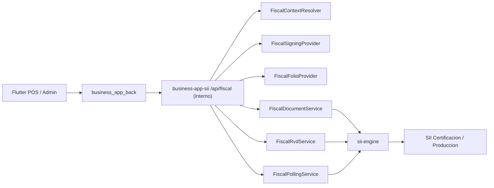

# Business App SII

Backend NestJS para operar documentos tributarios electronicos con `sii-engine` como unica capa fiscal y servir como plataforma fiscal privada interna del producto.

Este proyecto reemplaza la integracion antigua con SimpleAPI. No debe existir diseno, fallback, runtime, variables de entorno ni endpoints productivos asociados a SimpleAPI.

## Estado actual

- NestJS expone hoy una API REST util para desarrollo, certificacion e integracion, pero la topologia objetivo lo posiciona como backend fiscal privado para `business_app_back` u otros backends de negocio, no como API publica para Flutter.
- `sii-engine` se usa como libreria local para XML, firma, token SII, envio, validaciones fiscales, parsers y sanitizacion.
- `pnpm workspace` conecta este backend con la libreria local `sii-engine` mediante `"sii-engine": "workspace:*"`.
- La emision real de boleta electronica `tipoDTE=39` ya fue validada en certificacion SII con `trackId` y consulta de estado operativa, usando certificado y `CAF` persistidos por emisor.
- El flujo real de factura electronica `tipoDTE=33` ya obtiene CAF mediante scraping, importa folios en custody, genera/firma el DTE, realiza el upload legacy y consulta `QueryEstUp`/`QueryEstDte`.
- La custodia de certificados, password y `CAF` ya tiene una primera capa AWS-compatible por emisor. Lo que sigue pendiente para produccion es endurecer la persistencia de documentos, tracking, RVD y auditoria con storage transaccional, cifrado y auditable.

## Hito de avance al 2026-06-19

- `test/fiscal-real-sii.smoke-spec.ts` ya cubre token real, custodia por emisor, `CAF`, emision real y consulta de estado.
- `pnpm run test:real-sii:existing-caf` queda como regresion manual corta para la vertical boleta.
- `test/fiscal-real-sii-caf33.smoke-spec.ts` verifica scraping e importacion real de CAF 33.
- `test/fiscal-real-sii-factura33.smoke-spec.ts` verifica token, CAF 33, emision, upload con `TRACKID`, consulta de envio, consulta DTE y muestra impresa.
- El foco siguiente pasa a ser datos tributarios reales por emisor, persistencia durable del lifecycle fiscal, RVD, evidencia de certificacion e integracion con `business_app_back`.

## Responsabilidad de este proyecto

- actuar como plataforma fiscal privada del workspace
- custodiar certificados, CAF, folios y la automatizacion fiscal operativa
- exponer contratos internos para `business_app_back` u otros backends de negocio
- ejecutar el dialogo oficial con el SII usando `sii-engine` como core

## Limites

- no es la API publica del POS o de Flutter
- no reemplaza auth, ventas, inventario, usuarios ni reportes del dominio comercial
- no reimplementa el core tributario; hospeda y orquesta `sii-engine`

## Arquitectura



Responsabilidades:

- `business-app-sii`: contexto fiscal, secretos, certificados, CAF, folios, tracking, polling, RVD, respuestas saneadas y contratos internos para backends de negocio.
- `business_app_back`: autenticacion de usuarios, reglas comerciales, terminales, proyeccion del estado fiscal hacia la UI y orquestacion con la plataforma fiscal.
- `sii-engine`: construccion XML, TED, firmas, token SII, clientes SII, parsers, estados publicos y sanitizacion.
- Flutter: nunca recibe PFX, password, CAF completo, RSASK, private keys, token SII, cookies ni XML firmado, y no deberia llamar directo a `business-app-sii` en produccion.

## Requisitos

- Node.js compatible con NestJS 11.
- Corepack habilitado.
- pnpm `11.0.9`.
- Este repositorio debe conservar `business-app-sii` y `sii-engine` como carpetas hermanas.
- Certificado PFX valido para pruebas locales.
- CAF XML valido para el RUT emisor y tipo DTE requerido.

Estructura esperada en desarrollo:

```text
business-app/
  business-app-sii/
  sii-engine/
```

`pnpm-workspace.yaml` debe incluir:

```yaml
packages:
  - .
  - ../sii-engine
```

## Instalacion

Desde `business-app-sii`:

```powershell
corepack enable
corepack pnpm install
```

La resolucion de `sii-engine` queda amarrada a la estructura del repositorio, no a una ruta absoluta del equipo. Mientras ambas carpetas sigan siendo hermanas, no hace falta editar rutas por PC o por usuario.

Los scripts principales del backend (`build`, `start`, `start:dev`, `test`, `test:e2e`) construyen primero la libreria hermana `sii-engine`, para que los tipos y artefactos en `dist/` existan aunque el paquete este enlazado por workspace.

Verificar que `sii-engine` resuelve como workspace:

```powershell
corepack pnpm list sii-engine
```

## Variables de entorno

Minimo para levantar el backend:

```env
API_KEY_FRONTEND=change-me-local
PORT=3002
CORS_ORIGIN=http://localhost:3000
```

Bootstrap local/certificacion opcional:

```env
SII_AMBIENTE=0
SII_RUT_EMISOR=11111111-1
SII_RUT_FIRMANTE=22222222-2
SII_FECHA_RESOLUCION=2020-01-01
SII_NRO_RESOLUCION=0
SII_PFX_PATH=C:\secure\certificado.pfx
SII_PFX_PASSWORD=change-me
SII_CAF_PATH=C:\secure\caf-39.xml
```

Notas de seguridad:

- No commitear `.env`.
- No usar variables `SIMPLEAPI_*`; el arranque falla si detecta variables heredadas de SimpleAPI.
- En `NODE_ENV=production`, no se permite bootstrap fiscal desde `.env`. Produccion debe resolver PFX/CAF/emisores desde providers productivos por tenant.
- El PFX y CAF pueden usarse localmente solo para certificacion/desarrollo.

## Arranque local

```powershell
corepack pnpm run start
```

Con puerto explicito:

```powershell
$env:PORT="3002"
corepack pnpm run start
```

Swagger queda disponible en:

```text
http://localhost:3002/api
```

## Autenticacion

Los endpoints fiscales mutables requieren hoy el header:

```http
x-api-key: <API_KEY_FRONTEND>
```

En la topologia objetivo este backend debe quedar detras de una frontera privada y autenticacion service-to-service. Ese header actual sirve como bootstrap local, no como contrato final expuesto a Flutter.

El health fiscal puede usarse para diagnostico basico:

```http
GET /api/fiscal/health
```

## Contexto fiscal

Los endpoints aceptan `context` opcional. En desarrollo, si no se envia, se resuelve desde `.env`. En produccion, el contexto debe venir de tenant/merchant/branch/autorizacion/storage.

Ejemplo:

```json
{
  "context": {
    "tenantId": "tenant-local",
    "merchantId": "merchant-local",
    "branchId": "branch-1",
    "fechaResolucion": "2020-01-01",
    "nroResolucion": 0
  }
}
```

El RUT emisor, ambiente y certificado se resuelven internamente por `FiscalContextResolver` y providers.

## Endpoints

Base URL local:

```text
http://localhost:3002/api
```

### Health

```http
GET /api/fiscal/health
```

Respuesta esperada:

```json
{
  "success": true,
  "data": {
    "status": "ok"
  }
}
```

### Importar CAF XML emitido por SII

```http
POST /api/fiscal/folios/cafs
```

Body:

```json
{
  "context": {
    "fechaResolucion": "2020-01-01",
    "nroResolucion": 0
  },
  "cafXml": "<?xml version=\"1.0\"?><AUTORIZACION>...</AUTORIZACION>"
}
```

Respuesta publica:

```json
{
  "success": true,
  "data": {
    "rutEmisor": "11111111-1",
    "razonSocial": "EMPRESA DEMO",
    "tipoDTE": 39,
    "rangeStart": 1,
    "rangeEnd": 10,
    "fechaAutorizacion": "2026-01-01",
    "idk": "100"
  }
}
```

Nunca devuelve `cafXml`, `RSASK`, private key ni XML completo.

### Consultar estado de folios

```http
GET /api/fiscal/folios/status?tipoDTE=39&fechaResolucion=2020-01-01&nroResolucion=0
```

Respuesta:

```json
{
  "success": true,
  "data": [
    {
      "caf": {
        "rutEmisor": "11111111-1",
        "tipoDTE": 39,
        "rangeStart": 1,
        "rangeEnd": 10,
        "fechaAutorizacion": "2026-01-01"
      },
      "status": "active",
      "remaining": 10
    }
  ]
}
```

### Reservar folio

```http
POST /api/fiscal/folios/reserve
```

Body con folio automatico:

```json
{
  "context": {
    "fechaResolucion": "2020-01-01",
    "nroResolucion": 0
  },
  "tipoDTE": 39
}
```

Body con folio especifico:

```json
{
  "context": {
    "fechaResolucion": "2020-01-01",
    "nroResolucion": 0
  },
  "tipoDTE": 39,
  "folio": 10
}
```

### Solicitar CAF automaticamente desde portal SII

```http
POST /api/fiscal/folios/requests
```

Body:

```json
{
  "context": {
    "fechaResolucion": "2020-01-01",
    "nroResolucion": 0
  },
  "tipoDTE": 39,
  "quantity": 1,
  "idempotencyKey": "caf-demo-001"
}
```

Funcionamiento:

- Obtiene token SII usando certificado.
- Entra al portal SII de certificacion.
- Solicita folios.
- Descarga CAF.
- Valida e importa el CAF internamente.
- Devuelve solo metadata publica.

Variables utiles para diagnostico local:

```env
SII_PORTAL_CAF_AUTOMATION_ENABLED=true
SII_PORTAL_DEBUG_FORM=true
SII_PORTAL_HEADLESS=false
```

El diagnostico redacted no debe exponer token, cookies, CAF completo ni claves.

### Consultar folios CAF disponibles por scraping

```http
POST /api/fiscal/folios/availability
```

Body:

```json
{
  "context": {
    "fechaResolucion": "2020-01-01",
    "nroResolucion": 0
  },
  "tipoDTE": 33
}
```

Funcionamiento:

- Obtiene token SII usando certificado.
- Entra al portal SII de certificacion/produccion.
- Consulta el formulario de timbraje hasta la pantalla de confirmacion.
- Lee `Disponible` y `Maximo Autorizado`.
- No presiona `Obtener`, no descarga CAF y no consume/genera nuevos folios.

Respuesta publica:

```json
{
  "success": true,
  "data": {
    "status": "available",
    "method": "sii_portal_availability_scraping",
    "rutEmisor": "11111111-1",
    "environment": "CERTIFICACION",
    "tipoDTE": 33,
    "quantityProbed": 1,
    "availableFolios": 10,
    "maxAuthorizedFolios": 20,
    "retryable": false
  }
}
```

`Disponible 0 / Maximo Autorizado 0` no es una negativa concluyente. El portal puede mostrar ambos contadores en cero y aun permitir solicitar/descargar el CAF. Por eso el endpoint conserva los valores como diagnostico, devuelve `status: "available"` y el flujo de adquisicion intenta igualmente la solicitud directa.

### Emitir factura electronica 33

```http
POST /api/fiscal/documents/facturas
```

El flujo:

1. Reutiliza un CAF 33 activo o solicita uno mediante `POST /api/fiscal/folios/requests`.
2. Reserva el siguiente folio en custody.
3. Genera TED, DTE y `EnvioDTE` con firmas verificadas localmente.
4. Envia el multipart legacy requerido por `DTEUpload`.
5. Interpreta `<RECEPCIONDTE>`, conserva el `TRACKID` como texto y consulta:
   - `QueryEstUp.jws` para estado del envio.
   - `QueryEstDte.jws` para estado del documento.

Comandos reales de certificacion:

```powershell
ministack
corepack pnpm run ministack:bootstrap
corepack pnpm run test:real-sii:caf33
corepack pnpm run test:real-sii:factura33
```

Para reutilizar un CAF 33 existente:

```powershell
corepack pnpm run test:real-sii:factura33:existing-caf
```

El smoke completo fue verificado con sus cinco fases en verde. Obtener `STATUS=0` y `TRACKID` confirma que el SII recibio el upload. No implica por si solo que el DTE haya sido aceptado tributariamente: `QueryEstUp` puede informar documentos rechazados si razon social, giro, actividad, direccion, sucursal, resolucion u otros datos del emisor no coinciden con el ambiente SII.

### Emitir boleta electronica

```http
POST /api/fiscal/documents/boletas
```

Payload minimo para `tipoDTE=39`:

```json
{
  "context": {
    "fechaResolucion": "2020-01-01",
    "nroResolucion": 0
  },
  "document": {
    "idDoc": {
      "tipoDTE": 39,
      "fechaEmision": "2026-05-28",
      "indServicio": 3
    },
    "emisor": {
      "rutEmisor": "11111111-1",
      "rznSoc": "EMPRESA DEMO SPA",
      "giroEmis": "SERVICIOS INFORMATICOS",
      "dirOrigen": "SANTIAGO",
      "cmnaOrigen": "SANTIAGO",
      "ciudadOrigen": "SANTIAGO"
    },
    "receptor": {
      "rutRecep": "66666666-6",
      "rznSocRecep": "CONSUMIDOR FINAL"
    },
    "totales": {
      "mntTotal": 1000
    },
    "detalles": [
      {
        "nroLinDet": 1,
        "nmbItem": "Producto demo",
        "qtyItem": 1,
        "prcItem": 1000,
        "montoItem": 1000
      }
    ]
  }
}
```

Respuesta de upload aceptado:

```json
{
  "success": true,
  "data": {
    "internalId": "uuid-interno",
    "folio": 10,
    "trackId": "249813602",
    "status": "EPR"
  }
}
```

Notas:

- Si no se envia `folio`, el backend reserva el siguiente disponible.
- Para boleta, el backend normaliza el XML final a `EnvioBOLETA` con `SetDTE`, `Caratula version`, `IndServicio`, `FRMT`, `TmstFirma` y `User-Agent` requerido por SII.
- Si SII responde `RFR - Rut No Autorizado a Firmar`, el certificado llego al SII pero el RUT firmante no esta autorizado para firmar por el RUT empresa.

### Muestra impresa

```http
GET /api/fiscal/documents/:id/printed-sample
```

Usa `internalId` de una emision guardada en memoria. Devuelve datos publicos para impresion, incluido payload PDF417/TED, sin PFX ni CAF completo.

### Consultar estado de documento por endpoint de documentos

```http
GET /api/fiscal/documents/:id/status?fechaResolucion=2020-01-01&nroResolucion=0
```

Puede recibir `internalId` o `trackId`.

Limitacion actual:

- El upload de boleta funciona.
- La consulta de estado de boleta debe migrarse al endpoint REST especifico de boleta del SII; el cliente legacy puede fallar para boletas.

### Polling generico

```http
POST /api/fiscal/polling/send-status
```

Body:

```json
{
  "context": {
    "fechaResolucion": "2020-01-01",
    "nroResolucion": 0
  },
  "trackId": "249813602",
  "documentKind": "boleta",
  "attempt": 0
}
```

Tambien existe:

```http
POST /api/fiscal/polling/:trackId/poll-once
```

Body:

```json
{
  "context": {
    "fechaResolucion": "2020-01-01",
    "nroResolucion": 0
  },
  "documentKind": "boleta",
  "attempt": 0
}
```

### Enviar RVD

```http
POST /api/fiscal/rvd
```

Body:

```json
{
  "context": {
    "fechaResolucion": "2020-01-01",
    "nroResolucion": 0
  },
  "fecha": "2026-05-28",
  "secEnvio": 1,
  "totales": [
    {
      "tipoDTE": 39,
      "cantidad": 1,
      "montoTotal": 1000,
      "montoExento": 0,
      "montoIVA": 0
    }
  ]
}
```

Si `secEnvio` no viene, el backend lo resuelve con `FiscalRvdSequenceProvider` in-memory.

### Offline comercial recomendado

```http
POST /api/fiscal/edge/provisions
```

La arquitectura objetivo del producto no recomienda emision fiscal offline en Flutter. El POS debe guardar la venta localmente, imprimir solo un comprobante comercial y sincronizar despues con `business_app_back`, que a su vez coordina la boleta oficial con `business-app-sii`.

El endpoint anterior debe considerarse experimental o heredado. No forma parte del contrato recomendado con Flutter ni debe habilitarse en produccion sin reabrir la decision arquitectonica de llevar material fiscal al dispositivo.

## Flujo recomendado para certificacion

1. Configurar `.env` local con API key, RUT emisor, resolucion, PFX y CAF path, o cargar CAF por endpoint.
2. Levantar backend con `corepack pnpm run start`.
3. Verificar `GET /api/fiscal/health`.
4. Consultar folios con `GET /api/fiscal/folios/status`.
5. Si no hay CAF, importar CAF o solicitarlo con `/api/fiscal/folios/requests`.
6. Emitir boleta con `/api/fiscal/documents/boletas`.
7. Guardar `internalId`, `folio`, `trackId`, `status`.
8. Consultar estado con `GET /api/fiscal/documents/:internalId/status` o polling por `trackId`, y contrastar con correo/resultado SII si necesitas evidencia adicional.
9. Enviar RVD diario si corresponde.

## Seguridad

El backend aplica:

- `ApiKeyGuard` con `x-api-key`.
- `class-validator` en DTOs.
- Throttling por endpoint sensible.
- `helmet` y CORS configurable.
- Filtro global de errores sanitizado.
- Interceptor de respuesta que remueve payloads sensibles.
- Rechazo de variables `SIMPLEAPI_*`.
- Tests contra fugas de `rawResponse`, XML firmado, PFX, CAF, RSASK, private keys, token y password.

No exponer al frontend:

- PFX/P12.
- Password/passphrase.
- CAF XML completo.
- `RSASK`.
- Private keys.
- Token SII.
- Cookies de portal SII.
- XML firmado.
- `rawResponse`.

## Persistencia y produccion

El proyecto ya incluye una primera capa productiva de custodia fiscal por emisor para certificados y CAF:

- `POST /api/fiscal/issuers` registra o rota un PFX/password por `tenantId + rutEmisor + environment`.
- `FiscalSigningProvider` resuelve `certificateRef` persistido antes de caer al bootstrap local.
- `FiscalFolioProvider` guarda CAF por emisor cuando el `IssuerContext` trae `tenantId`.
- La adquisicion de CAF por scraping importa automaticamente el XML descargado y lo deja disponible para el mismo emisor.

### Storage AWS recomendado

La implementacion actual esta optimizada para costo operativo bajo:

- `S3` guarda blobs grandes o binarios: `PFX/P12` y `CAF XML`.
- `SSM Parameter Store (SecureString)` guarda solo `pfxPassword`.
- `DynamoDB` guarda metadata del emisor, referencias a objetos y cursor `nextFolio`.

Variables:

```env
AWS_REGION=sa-east-1
AWS_FISCAL_DDB_TABLE=business-app-sii-fiscal
AWS_FISCAL_S3_BUCKET=business-app-sii-fiscal
AWS_FISCAL_S3_PREFIX=fiscal-custody
AWS_FISCAL_SSM_PREFIX=/business-app-sii/fiscal
```

Opcionales:

```env
AWS_FISCAL_S3_KMS_KEY_ID=arn:aws:kms:...
AWS_FISCAL_SSM_KMS_KEY_ID=alias/aws/ssm
```

Recomendacion de costos:

- Partir con `DynamoDB On-Demand` si el volumen por tenant es bajo o irregular.
- Usar cifrado `SSE-S3` por defecto para evitar costo por request de KMS; activar `AWS_FISCAL_S3_KMS_KEY_ID` solo si compliance lo exige.
- Mantener un solo bucket y una sola tabla para todos los emisores, separando por llaves logicas.
- Guardar en SSM solo el password; no usar Secrets Manager salvo necesidad de rotacion administrada o politicas mas avanzadas.

### Desarrollo local con Ministack

El repo queda preparado para usar `S3 + DynamoDB + SSM Parameter Store` sobre MiniStack en `http://127.0.0.1:4566`.

Archivo incluido:

- `.env.ministack`

Comandos:

```powershell
pnpm run ministack:start
pnpm run ministack:bootstrap
pnpm run start:dev:ministack
```

Que hace cada uno:

- `ministack:start`: levanta MiniStack en una terminal dedicada, con `TMPDIR` y estado persistente local bajo `.ministack/`.
- `ministack:bootstrap`: verifica health, crea bucket S3, crea tabla DynamoDB y prueba `SecureString` en SSM.
- `start:dev:ministack`: arranca `business-app-sii` usando las variables de `.env.ministack`.

En Windows, este flujo se deja en foreground de forma intencional porque el modo detach del CLI de MiniStack puede fallar silenciosamente con rutas temporales/logs. Para detenerlo, usar `Ctrl+C` en la terminal donde corre `pnpm run ministack:start`.

Variables locales relevantes:

```env
AWS_REGION=us-east-1
AWS_ACCESS_KEY_ID=test
AWS_SECRET_ACCESS_KEY=test
AWS_ENDPOINT_URL=http://127.0.0.1:4566
AWS_FISCAL_DDB_ENDPOINT=http://127.0.0.1:4566
AWS_FISCAL_S3_ENDPOINT=http://127.0.0.1:4566
AWS_FISCAL_SSM_ENDPOINT=http://127.0.0.1:4566
AWS_FISCAL_S3_FORCE_PATH_STYLE=true
```

Internamente `FiscalCustodyService` ya soporta endpoint global (`AWS_ENDPOINT_URL`) y overrides por servicio para DynamoDB, S3 y SSM.

Datos que deben persistirse:

- `tenantId`, `merchantId`, `branchId`, RUT emisor.
- CAF metadata, rango y folios reservados/consumidos.
- `internalId`, tipo DTE, folio, `trackId`, estado publico.
- Intentos, `nextPollAt`, fechas, errores normalizados.
- Respuestas crudas solo en storage protegido, nunca hacia frontend.

Ejemplo de onboarding de emisor:

```http
POST /api/fiscal/issuers
Content-Type: application/json
x-api-key: ***
```

```json
{
  "tenantId": "tenant-demo",
  "merchantId": "merchant-main",
  "branchId": "branch-001",
  "rutEmisor": "76123456-0",
  "environment": "CERTIFICACION",
  "fechaResolucion": "2020-01-01",
  "nroResolucion": 80,
  "pfxBase64": "<base64-del-pfx>",
  "pfxPassword": "<password-del-pfx>",
  "rutFirmante": "12345678-5"
}
```

Con eso, el scraping de CAF para ese mismo `tenantId + rutEmisor + environment` queda listo para persistir el CAF descargado y servir folios despues.

## Comandos de validacion

```powershell
corepack pnpm run build
corepack pnpm exec jest --runInBand
corepack pnpm run test:e2e
corepack pnpm exec eslint "{src,apps,libs,test}/**/*.ts"
```

Nota: para ejecutar Jest en serie usar `corepack pnpm exec jest --runInBand`. El script `pnpm test -- --runInBand` puede interpretar el patron como filtro y no encontrar tests.

## Troubleshooting

### Variables SimpleAPI detectadas

Eliminar del `.env` cualquier variable que empiece con `SIMPLEAPI_`. El backend ya no usa SimpleAPI.

### `No existe contexto fiscal autorizado`

Faltan variables locales de contexto (`SII_RUT_EMISOR`, `SII_FECHA_RESOLUCION`, `SII_NRO_RESOLUCION`) o el emisor aun no fue registrado en `POST /api/fiscal/issuers`.

### `No se encontro un CAF valido`

El CAF no fue cargado, pertenece a otro RUT, otro ambiente, otro tipo DTE o el provider in-memory fue reiniciado.

### `RSC` por schema

El SII recibio el XML pero lo rechazo por validacion XSD. Revisar `detail` publico. No registrar XML firmado ni raw response en logs publicos.

### `RFR - Rut No Autorizado a Firmar`

El upload llego al SII, pero el RUT del certificado no esta autorizado para firmar por la empresa. Debe autorizarse en el SII o usar un certificado de representante autorizado.

### Smoke real o consulta de estado no cuadran con el correo SII

Revisar los artefactos bajo `secure/real-sii-tests/artifacts/<folio>/` y comparar `trackId`, estado consultado y XML de respuesta. El smoke real deja evidencia suficiente para diagnosticar diferencias entre lo que responde la API y lo que informa el SII por correo.

### Upload con `TRACKID`, pero `RECHAZADOS > 0`

El transporte y la autenticacion funcionaron, pero el procesamiento tributario rechazo uno o mas DTE. Consultar `QueryEstUp` y `QueryEstDte`, y revisar que los datos del emisor coincidan exactamente con el registro de certificacion SII. No reemplazar esos datos con valores demo en una validacion formal.

## Pendientes principales

- Persistencia durable para documentos emitidos, RVD, trackId, polling y auditoria.
- Automatizar RVD diario y conciliacion completa de boletas por dia.
- Validacion XSD real, golden fixtures y evidencia formal de certificacion.
- Endpoint host-to-host en `business_app_back` para onboarding y sincronizacion de emisores contra `business-app-sii`.
- Completar certificacion funcional de factura 33 con los datos tributarios oficiales de cada emisor.
- Completar nota de credito 61 y los demas DTE fuera de boleta/factura.
- Workers de polling con locks, backoff y rate limits.
