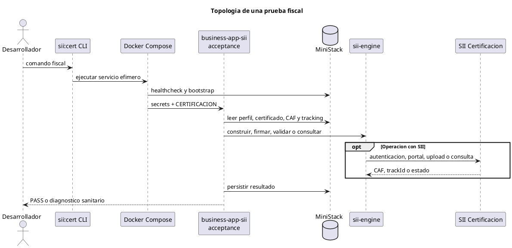
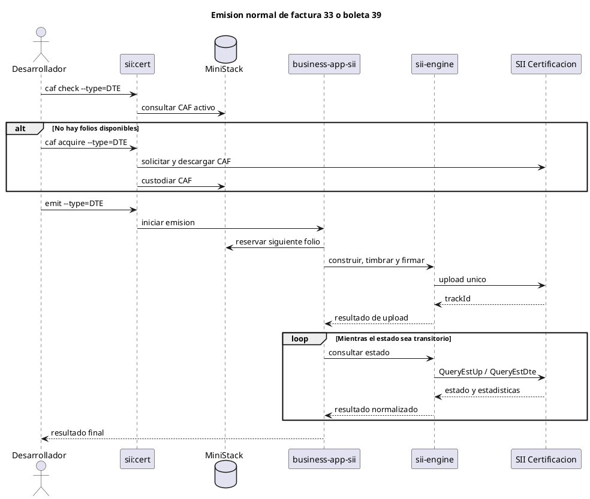
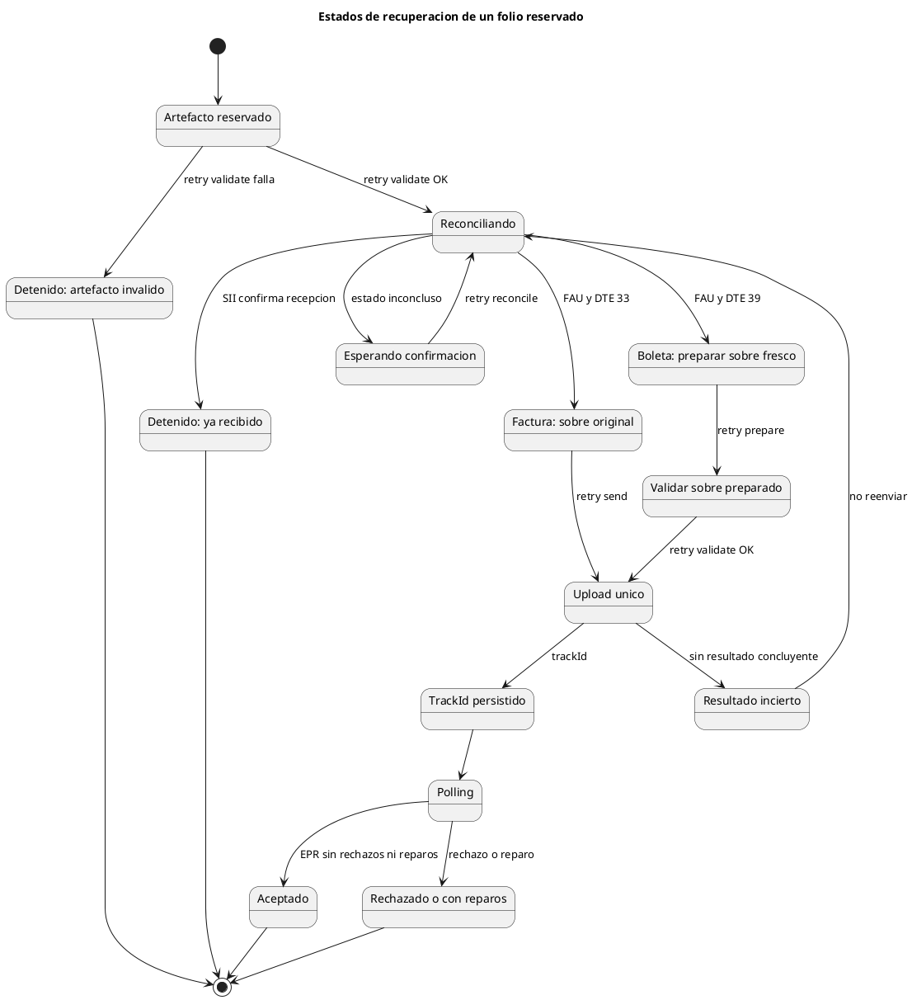

# Runbook de pruebas fiscales

Estado: fuente unica de verdad para ejecutar comandos fiscales de prueba.
Actualizado: 2026-07-12.

Este documento define como probar factura 33 y boleta 39, adquirir o consultar
CAF y recuperar folios reservados. Los demas documentos deben enlazar este
runbook y no repetir comandos operativos.

La arquitectura de las imagenes se mantiene en
[docker-testing-production.md](./docker-testing-production.md) y los resultados
comprobados en [current-status.md](./current-status.md).

## Reglas de seguridad

- Todos los comandos `sii:cert` usan exclusivamente SII `CERTIFICACION`.
- Compose fija el ambiente y cada smoke lo valida antes de contactar al SII.
- `emit`, `caf acquire` y un `retry send` sin resultado previo realizan efectos reales.
- Nunca ejecutar suites fiscales en paralelo para el mismo emisor.
- Nunca repetir `retry send` ante resultado incierto: ejecutar `retry reconcile`.
- Produccion se habilita solo al desplegar el target Docker `runtime`; no se prueba con `sii:cert`.
- No usar `docker compose down -v`: elimina la custodia fiscal local.

## Preparacion

- `.env`: configuracion local no sensible basada en `.env.example`.
- `secrets/certificado.pfx`: certificado del firmante.
- `secrets/pfx-password.txt`: password del PFX.
- `secrets/api-key.txt`: API key del runtime productivo.

PFX, password, tokens, CAF privados y XML firmados no deben quedar en `.env`,
Git ni capas de imagen.

Despues de cambiar codigo, reconstruir la imagen de aceptacion. En la primera
ejecucion, validar tambien la custodia:

```powershell
docker compose -f compose.yaml -f compose.certification.yaml build emit-factura33 emit-boleta39
pnpm.cmd run sii:cert -- custody test
```

## Topologia de prueba



MiniStack implementa localmente las interfaces de S3, DynamoDB y SSM. No se
requiere una cuenta AWS para este flujo.

## Referencia de comandos

| Comando                  | Contacta SII                 | Consume o reserva folio | Proposito                                       |
| ------------------------ | ---------------------------- | ----------------------- | ----------------------------------------------- |
| `custody test`           | No                           | No                      | Validar custodia MiniStack con datos sinteticos |
| `caf check --type=...`   | No                           | No                      | Consultar CAF activo y folios disponibles       |
| `caf acquire --type=...` | Si                           | Si                      | Solicitar/importar CAF de forma explicita       |
| `emit --type=...`        | Si                           | Si                      | Emitir un documento nuevo con CAF custodiado    |
| `retry validate`         | No                           | No                      | Validar identidad, XSD, TED y XMLDSig           |
| `retry reconcile`        | Si, solo consulta            | No                      | Confirmar si un folio fue recibido              |
| `retry prepare`          | No                           | No                      | Regenerar firmas frescas de boleta 39           |
| `retry send`             | Si, salvo trackId persistido | No reserva otro         | Enviar una vez o reanudar consultas             |
| `down`                   | No                           | No                      | Detener contenedores conservando custodia       |

Los valores admitidos por `--type` son `factura`, `boleta`, `33` y `39`.
`--quantity` acepta entre 1 y 50, representa un maximo y solo aplica a
`caf acquire`; la disponibilidad del SII puede reducir la cantidad obtenida.

Ayuda de la CLI:

```powershell
pnpm.cmd run sii:cert -- help
```

Timeouts opcionales en `.env`:

| Variable                    | Default | Uso                               |
| --------------------------- | ------: | --------------------------------- |
| `SII_CERT_STATUS_SETTLE_MS` |    5000 | Espera inicial antes de consultar |
| `SII_CERT_POLL_TIMEOUT_MS`  |  120000 | Limite total del polling          |
| `SII_CERT_POLL_INTERVAL_MS` |   10000 | Intervalo entre consultas         |

## Emision normal



`emit` nunca adquiere CAF implicitamente. Primero se consulta custodia; solo si
no quedan folios se ejecuta `caf acquire`.

### Factura 33

```powershell
pnpm.cmd run sii:cert -- caf check --type=factura
pnpm.cmd run sii:cert -- caf acquire --type=factura --quantity=5
pnpm.cmd run sii:cert -- emit --type=factura
```

La segunda linea es condicional. Factura usa token DTE, `EnvioDTE`, Maullin y
`QueryEstUp`/`QueryEstDte` en Certificacion.

### Boleta 39

```powershell
pnpm.cmd run sii:cert -- caf check --type=boleta
pnpm.cmd run sii:cert -- caf acquire --type=boleta --quantity=5
pnpm.cmd run sii:cert -- emit --type=boleta
```

La segunda linea es condicional. Boleta usa token DTE, `EnvioBOLETA`, Maullin y
`QueryEstUp`/`QueryEstDte` en Certificacion. Produccion usa otra estrategia
explicita basada en token de boleta, Rahue y API REST; no existe fallback entre
ambientes.

## Recuperacion de folios

La recuperacion aplica cuando un folio fue reservado y existe un artefacto
firmado, pero no hay certeza de recepcion o falta completar su seguimiento.



### Semantica de cada etapa

- `retry validate`: no usa red ni reserva folios. Valida el artefacto seleccionado.
- `retry reconcile`: consulta por RUT, tipo, folio, fecha, monto y receptor; no hace upload.
- `retry prepare`: solo boleta 39. Reutiliza el TED validado y renueva `TmstFirma`, `TmstFirmaEnv` y ambas XMLDSig.
- `retry send`: valida antes del upload y persiste `retry-attempt.json` y `retry-result.json`.
- Si existe `retry-result.json`, `retry send` omite firma fresca y upload; solo reanuda consultas con el `trackId` guardado.
- `EPR - Envio Procesado` es terminal para `QueryEstUp`; sus estadisticas determinan aceptacion, rechazo o reparo.

### Recuperar factura 33

Definir el folio reservado antes de ejecutar la secuencia:

```powershell
$Folio = 123 # Reemplazar por el folio reservado
pnpm.cmd run sii:cert -- retry validate --type=factura --folio=$Folio
pnpm.cmd run sii:cert -- retry reconcile --type=factura --folio=$Folio
pnpm.cmd run sii:cert -- retry send --type=factura --folio=$Folio
```

Ejecutar `retry send` solo cuando `reconcile` confirme que no fue recibido. La
factura reenvia exactamente su `EnvioDTE` firmado y nunca reserva otro folio.

### Recuperar boleta 39

Definir el folio reservado antes de ejecutar la secuencia:

```powershell
$Folio = 123 # Reemplazar por el folio reservado
pnpm.cmd run sii:cert -- retry validate --type=boleta --folio=$Folio
pnpm.cmd run sii:cert -- retry reconcile --type=boleta --folio=$Folio
pnpm.cmd run sii:cert -- retry prepare --type=boleta --folio=$Folio
pnpm.cmd run sii:cert -- retry validate --type=boleta --folio=$Folio
pnpm.cmd run sii:cert -- retry send --type=boleta --folio=$Folio
```

`retry prepare` requiere una reconciliacion `FAU` y genera un sobre valido por
15 minutos. Tras preparar, validar y enviar inmediatamente. Si el upload tiene
resultado incierto, no repetirlo.

Para un artefacto que pertenece explicitamente a otro tenant:

```powershell
$Folio = 123
$TenantId = 'tenant-id'
pnpm.cmd run sii:cert -- retry reconcile --type=boleta --folio=$Folio --tenant=$TenantId
```

Nunca se buscan certificados o CAF entre tenants automaticamente.

## Criterios de aprobacion

- upload con `trackId` persistido;
- `EPR` con estadisticas sin rechazados ni reparos;
- factura o boleta con estado DTE final aceptado cuando la consulta lo entregue;
- estados transitorios reintentados dentro de un timeout acotado;
- `RSC`, `RCT`, `RCH`, `RFR`, `RPR` y errores DTE definitivos producen fallo;
- logs sin PFX, password, token, cookie, CAF completo ni XML firmado.

## Artefactos y cierre

Los XML y metadatos protegidos quedan fuera de Git en:

```text
secure/real-sii-tests/artifacts/
```

Para detener los servicios conservando el volumen fiscal:

```powershell
pnpm.cmd run sii:cert -- down
```

El volumen `business-app-sii_ministack-state` conserva perfiles, PFX, password,
CAF, reservas y tracking entre ejecuciones.
